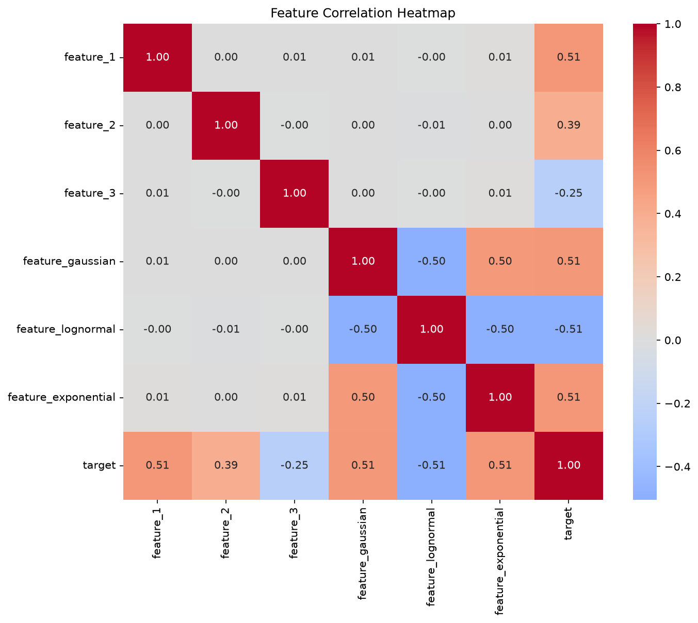
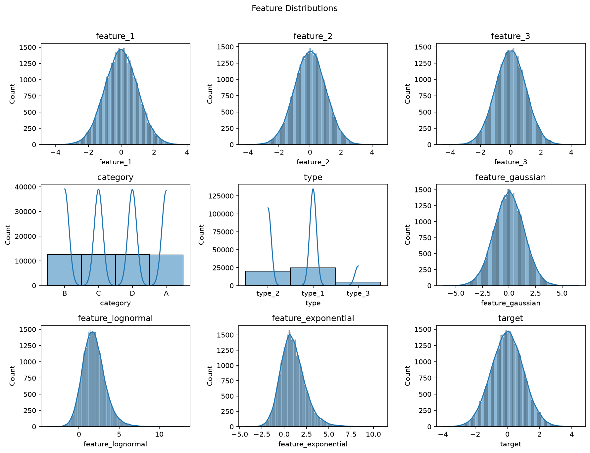

# Drift Detector

A framework for testing real-time data drift detection on regression models.

## Quick start

```bash
# generate synthetic data
generate_data --n-samples 50000 --seed 42

# split into train/test
split_data --input data/raw/data.csv --test-size 0.2 --seed 42

# optimise hyper-parameters then train final model
drift_detector --optimise --train

# train only (uses config defaults)
drift_detector --train --model ridge
```

### CLI options

| Flag | Description |
|---|---|
| `--model` | Model to use: `random_forest` (default), `xgboost`, `ridge`, `linear` |
| `--optimise` | Run Optuna hyper-parameter search |
| `--train` | Train a final model |
| `--configs-dir` | Config directory (default: `configs/`) |

Flags can be combined: `--optimise --train` runs Optuna first, then trains with the best parameters.

## Dataset

Synthetic regression dataset generated via `src/drift_detector/data/generate.py`.
Features are designed with known correlation strengths to the target, making it
suitable for testing drift detection methods under controlled conditions.

| Feature | Distribution | Correlation with target |
|---|---|---|
| `feature_1` | Gaussian (standardised) | +0.29 |
| `feature_2` | Gaussian (standardised) | +0.22 |
| `feature_3` | Gaussian (standardised) | -0.14 |
| `feature_gaussian` | Gaussian + noise | +0.28 |
| `feature_lognormal` | Log-normal (skewed) | -0.28 |
| `feature_exponential` | Exponential + noise | +0.29 |
| `category` | Categorical (A/B/C/D) | — |
| `type` | Categorical (type_1/2/3) | — |

Target is standardised to zero mean, unit variance.

## Plots

| Correlation Heatmap | Feature Distributions |
|---|---|
|  |  |

## To do
- [ ] Add tests
- [ ] Pydantic validation
- [ ] Update README
- [ ] Final retraining pipeline
- [ ] Add plot artifacts to mlflow
